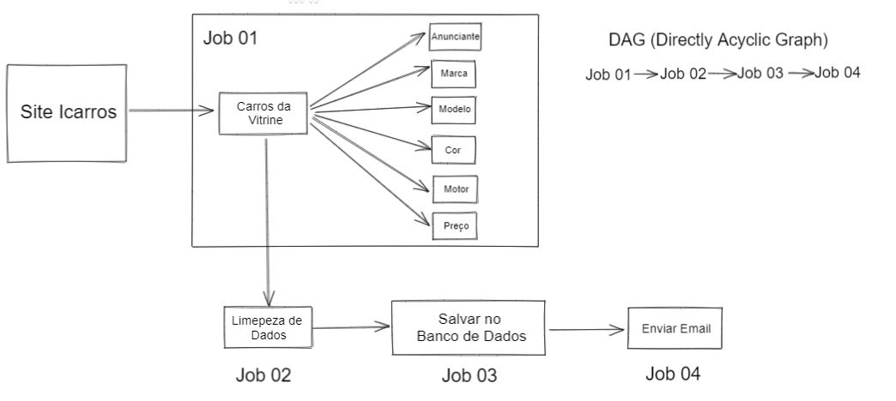
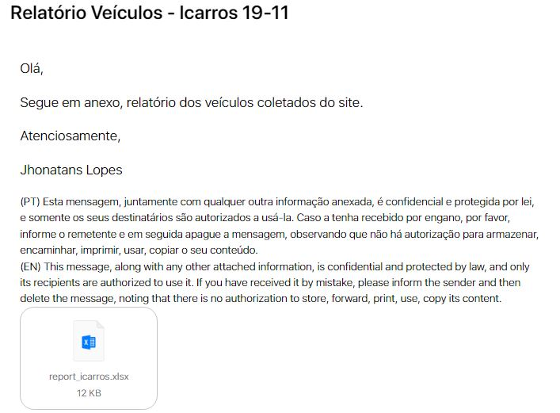
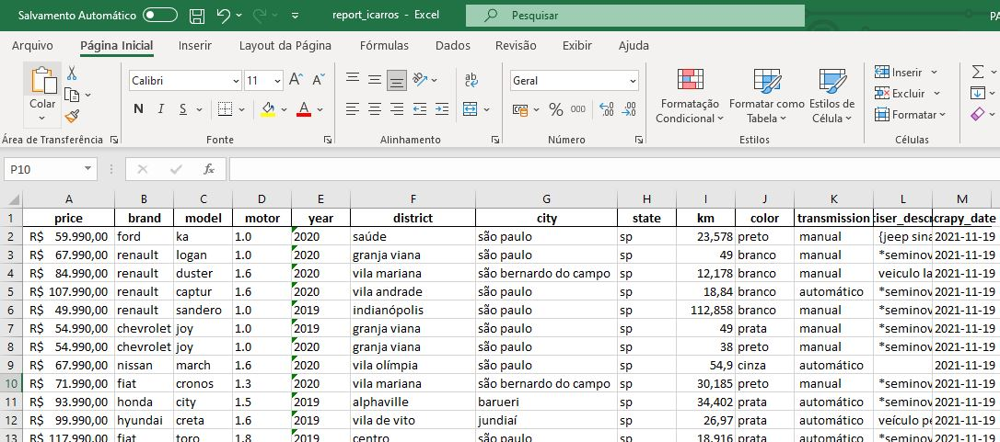

  

# Etl-Car-Recommendation

ETL para uma empresa que realiza Revenda de Carros Usados.

<p align="center">
  
</p>

# Contexto do Problema

Uma pequena empresa tradicional e familiar de compra e venda de carros usados localizada em São Paulo, realiza seu processo por procura de carros olhando anúncio por anúncio no site Icarros. Por ser um processo manual e diario, a empresa perde tempo de produtividade.

Com isso, os donos querem melhorar seus processos visando garatir eficiencia e ainda conseguir comprar melhores carros para seu negócio.

# Entendimento do Problema

- Motivação:

  - Melhorar a eficiência e produtividade dos processos.

- Causa Raiz do Problema:

  - Automatizar a coleta de dados e a disponibilização aos donos do negócio de forma rápida e fácil.

- Formato da Entrega:

  - Os dados serão salvos em banco de dados e disponibilizados em um arquivo excel semanalmente.

# Arquitetura do ETL

<p align="center">
  
</p>

# Documentação

# Entrega da Solução

Envio do email:

<p align="center">
  
</p>

Arquivo excel:

<p align="center">
  
</p>

# Utilização

Para executar este projeto em sua máquina, siga estes passos:

1 - Clone o repositório e instale as dependências do arquivo **requirements.txt**

2 - Caso não tenha, instale o [Outlook](https://support.microsoft.com/pt-br/office/baixe-e-instale-ou-reinstale-o-microsoft-365-ou-o-office-2021-em-um-computador-ou-mac-4414eaaf-0478-48be-9c42-23adc4716658) em sua máquina. Pois o email será enviado com a integração do python e Outlook.

3 - Caso não tenha, cire uma [conta](https://www.microsoft.com/pt-br/microsoft-365/outlook/email-and-calendar-software-microsoft-outlook) para obter acesso ao email do Outlook e deixe logado em sua conta.

4 - Caso não tenha, instale o [MySQL](https://www.mysql.com/downloads/). Após isso, crie um banco de dados e insira seus dados no arquivo **scr/loading.py**, como abaixo:

```
  7  | database_username = 'YOUR USER'
  8  | database_password = 'YOUR PASSWORD'
  9  | database_ip       = '127.0.0.1'
  10 | database_name     = 'YOUR DATABASE'
```

5 - Use este código para criar a tabela e as colunas do banco de dados:

```
    CREATE TABLE tb_cars (
    brand TEXT,
    price DOUBLE,
    model TEXT,
    motor TEXT,
    year TEXT,
    district TEXT,
    city TEXT,
    state TEXT,
    km DOUBLE,
    color TEXT,
    transmission TEXT,
    advertiser_description TEXT,
    scrapy_date TEXT
  )
```

6 - No arquivo **src/report.py** insira algum endereço de email para receber o envio da entrega final:

```
  42 | email.To = 'YOUR EMAIL'
```

Em seguida, no mesmo arquivo insira todo o caminho até a pasta **report** + nome do arquivo.

por exemplo: C:/Users/Jhonatans/projects/ETL/Etl-Car-Recommendation/report/ + report_icarros.xlsx. Inisra o caminho no código abaixo:

```
  58 | file = 'ALL PATH/report_icarros.xlsx'
```

# Versões Futuras

Ao todo, haverá mais 3 versões além da 1º deste projeto. O que mudará?

- Versão 2.0: Será incluido a orquestração dos Jobs utizando a ferramenta [Airflow](https://airflow.apache.org/) com o objetivo de schedular a execução do ETL em determinado dia e hora.

- Versão 3.0: Será realizado o deploy do ETL no S3 da AWS. Com o objetivo de executar o Jobs nos dias determinados mesmo sem a maquina física estar ligada.

- Versão 4.0: Além do site Icarros, será coletado carros de mais sites diferentes. E, será enviado recomendações de quais carros a empresa deve comprar.
